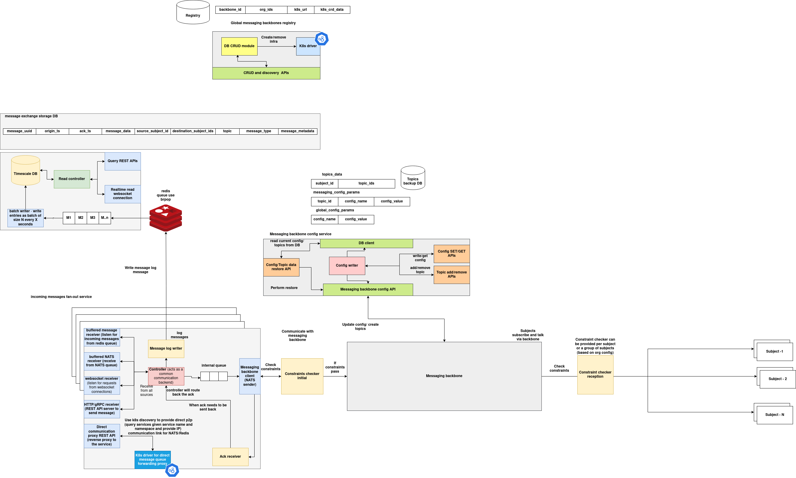

# Communication System

## System Overview

This system provides a modular and extensible messaging infrastructure designed for **distributed, multi-agent environments** operating across federated Kubernetes clusters. It enables the ingestion, routing, logging, and real-time observation of messages exchanged between autonomous services or agents.

The architecture supports multiple message ingestion protocols, enforces topic- and subject-level constraints, provides time-series logging capabilities, and manages dynamic communication backbones deployed per cluster. Each component in the architecture serves a specific role, collectively ensuring high availability, consistency, and auditability of inter-service communications.

The system is particularly suited for environments where agent-to-agent or service-to-service communication must be **configurable, traceable, and policy-controlled**, such as in federated AI systems, orchestration platforms, or secure communication meshes.

---

## Core Services

### Fanout Service

The Fanout Service is the **primary message ingress layer**. It acts as a multi-protocol gateway that accepts and normalizes structured messages submitted via:

* HTTP POST endpoints
* WebSocket frames
* Redis push (list-based ingestion)
* NATS subscriptions

Each incoming message is validated and passed through a centralized pipeline. Depending on configuration and constraints, messages are routed to:

* The Redis logging queue for persistence
* The internal messaging backbone (typically NATS) for distribution to downstream agents or services

The Fanout Service abstracts protocol-specific differences, offering a uniform interface into the backend system.

---

### Message Logger Service

The Message Logger Service is responsible for **persisting all message exchanges** into a long-term, queryable database. It consists of:

* A Redis queue consumer (`BRPOP`-based), which buffers messages into memory
* A batched writer that inserts data into **TimescaleDB**, a PostgreSQL extension optimized for time-series storage
* A REST API that supports querying messages by UUID or subject
* A WebSocket server that broadcasts newly ingested messages to subscribed clients in real-time

This service provides a durable audit log of all inter-agent communication and supports use cases such as debugging, monitoring, forensic analysis, and compliance tracking.

---

### Messaging Backbone (NATS)

The system uses **NATS-based backbones** as the core communication layer between agents and services. These backbones are dynamically deployed into Kubernetes clusters using Helm, and each deployment includes:

* JetStream support for message durability and streaming
* Cluster-aware replication configuration
* Exposure via a public URL for use in subject-based publish/subscribe operations

Subjects subscribe and publish messages through these NATS exchanges. Each exchange is tracked via the **Backbone Registry**, allowing other services to discover and route through the appropriate cluster-local or global exchange.

---

### Backbone Registry Service

The Backbone Registry maintains a **global registry of deployed messaging backbones**. Each record includes:

* A unique system identifier
* Associated organization and cluster IDs
* The public endpoint for accessing the exchange
* Arbitrary metadata such as region, version, and operational status

This registry enables dynamic routing, lookup, and management of messaging infrastructure across clusters. It is used internally by the Fanout Service and Config Services to resolve routing paths for target subjects.

---

### Configuration Store

The Configuration Store provides **centralized configuration management** for:

* Per-topic scoped configurations (e.g., rate limits, buffer sizes, retry policies)
* Global system-level configurations

It exposes a REST API for reading, writing, and updating configuration values. Internally, it is accessed by the Fanout Service, Constraint Checkers, and Config Writers to enforce consistent and dynamic messaging behavior.

---

### Constraint Checker

Before messages are routed through the messaging backbone to recipient subjects, the **Constraint Checker** is invoked to validate operational and policy-related constraints. This can include:

* Rate-limiting checks
* Permission and authorization validation
* DSL-based policy evaluations
* Subject-specific message handling rules

Constraint logic can be injected per subject or per topic using configuration metadata. This ensures secure and rule-compliant communication at runtime.

---

### Query and Streaming Interfaces

Two interfaces are provided for external observability:

* **Query REST API**: Supports structured queries by message UUID or subject ID.
* **WebSocket Server**: Allows clients to subscribe to live message feeds as they are pushed into Redis, suitable for dashboards and monitoring tools.

These interfaces support both batch and real-time observability of the system’s communication traffic.

---

## Key Features

### Multi-Protocol Ingestion

The architecture supports ingestion via multiple transport protocols, ensuring compatibility with a wide range of external systems and agents. This includes:

* REST (HTTP)
* Duplex channels (WebSocket)
* Queue-based (Redis)
* Native pub-sub (NATS)

Each message is transformed into a consistent internal format to ensure uniform processing.

---

### Persistent and Queryable Logging

Messages are not transient. Every valid message is logged into a durable storage backend (TimescaleDB) with support for:

* Structured fields (UUIDs, subjects, timestamps, topics, metadata)
* Time-series optimizations
* Batch insertion
* Query APIs

This allows for complete traceability and historical analysis of all message exchanges.

---

### Configurable Messaging Backbone Deployment

Messaging infrastructure is not static. The system dynamically deploys NATS-based exchanges into clusters and maintains their metadata through the Backbone Registry. Each exchange:

* Is deployed via Helm using standardized values
* Can be updated or removed via exposed APIs
* Is discoverable through the registry

This enables flexible scaling and dynamic cluster integration.

---

### Centralized Configuration Management

The Config Store allows for:

* Topic-specific and global configuration control
* Real-time updates without redeployment
* Access control via REST APIs

It ensures consistency in message processing behavior across all components.

---

### Policy Enforcement via Constraint Checking

The system includes a constraint enforcement layer that can:

* Block messages
* Route messages conditionally
* Validate compliance with domain-specific rules

Constraints are applied before message delivery, supporting secure and policy-governed communication.

---

### Real-Time Observability

The WebSocket server enables:

* Sub-second delivery of incoming messages to dashboards
* Live introspection into communication streams
* Proactive debugging of message-related issues

---
