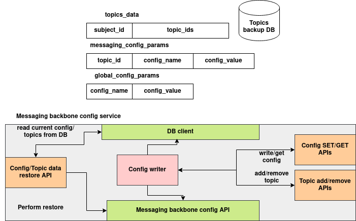

# Config Store

## Introduction

The Config Store provides a centralized system for managing configuration values used across distributed services. It supports:

* **Topic-scoped configs** tied to specific subjects or service groups
* **Global configs** that apply system-wide
* **REST APIs** to read, write, and update configurations

This store is built using SQLAlchemy and Flask, with a relational backend and proper logging/error handling.

---

## Architecture



---

## Schema Overview

### `topics_data`

| Field       | Type | Description                                         |
| ----------- | ---- | --------------------------------------------------- |
| subject\_id | UUID | Unique ID for a topic group or subject              |
| topic\_ids  | str  | Comma-separated or JSON string of topic identifiers |

### `messaging_config_params`

| Field         | Type | Description                                      |
| ------------- | ---- | ------------------------------------------------ |
| id            | UUID | Unique config entry ID                           |
| topic\_id     | UUID | Foreign key referencing `topics_data.subject_id` |
| config\_name  | str  | Name of the configuration key                    |
| config\_value | str  | Value of the configuration                       |

### `global_config_params`

| Field         | Type | Description                     |
| ------------- | ---- | ------------------------------- |
| config\_name  | str  | Globally unique config key name |
| config\_value | str  | Config value                    |

---

## 3. REST API Reference

### Topics Data

#### `POST /topics_data`

Create a new topic group.

```json
{
  "subject_id": "optional-uuid",
  "topic_ids": ["topic1", "topic2"]
}
```

#### `PUT /topics_data/<subject_id>`

Update the topic IDs for an existing subject.

```json
{
  "topic_ids": ["topic1", "topic3"]
}
```

#### `GET /topics_data/<subject_id>`

Get a single topic data entry by subject ID.

#### `GET /topics_data`

List all topic data entries.

---

### Messaging Config (Scoped)

#### `POST /messaging_config`

Create a new topic-scoped config.

```json
{
  "topic_id": "uuid",
  "config_name": "timeout_ms",
  "config_value": "5000"
}
```

#### `PUT /messaging_config/<topic_id>`

Update the value for a given config name under a topic.

```json
{
  "config_name": "timeout_ms",
  "config_value": "10000"
}
```

#### `GET /messaging_config/<topic_id>`

Fetch all configs for a given topic ID.

#### `GET /messaging_config/<topic_id>/<config_name>`

Fetch a specific config by name for a given topic.

---

### Global Config

#### `POST /global_config`

Create a global config.

```json
{
  "config_name": "default_timeout",
  "config_value": "3000"
}
```

#### `PUT /global_config/<config_name>`

Update an existing global config.

```json
{
  "config_value": "3500"
}
```

#### `GET /global_config/<config_name>`

Fetch a global config by name.

#### `GET /global_config`

Fetch all global configs.

---


