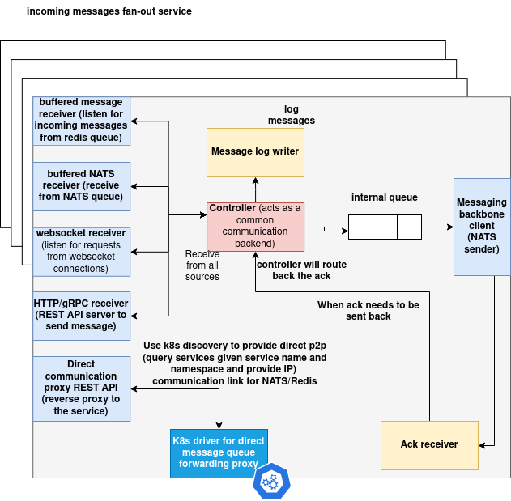

# Fanout Service Documentation

## Introduction

The **Fanout Service** functions as a gateway and protocol translation layer for a distributed communication mesh. Its main objective is to enable external systems to deliver structured messages into an internal messaging infrastructure based on NATS. The service abstracts away protocol-specific details from clients and offers a unified path into the backend system.

### Key Responsibilities

* Acts as a message ingestion gateway
* Supports multiple external protocols for message delivery
* Bridges frontend protocols to an internal backend using NATS
* Provides message logging to a persistent Redis queue for audit and debugging

---

## Architecture



---

## Supported Frontend Protocols

The Fanout Service supports the following protocols for incoming messages:

| Protocol  | Transport Type | Endpoint Description                              |
| --------- | -------------- | ------------------------------------------------- |
| HTTP      | REST API       | Accepts POST requests to `/MESSAGES`              |
| WebSocket | Duplex channel | Accepts WebSocket frames at `/MESSAGES`           |
| Redis     | Queue listener | Blocks on a Redis list (`BRPOP`) named `MESSAGES` |
| NATS      | Subscription   | Subscribes to a subject called `MESSAGES`         |

All incoming messages are JSON payloads and must contain a `topic` field indicating the backend NATS topic to which the message should be routed.

---

## Pushing Messages Using Each Protocol

### HTTP

#### Endpoint

```
POST /MESSAGES
Content-Type: application/json
```

#### Payload

```json
{
  "message": "{\"topic\": \"internal.updates\", \"data\": {\"value\": 42}}"
}
```

#### Python Example

```python
import requests
import json

message = {
    "topic": "internal.updates",
    "data": {"value": 42}
}

response = requests.post(
    "http://<host>:<port>/MESSAGES",
    json={"message": json.dumps(message)}
)

print(response.json())
```

#### cURL Example

```bash
curl -X POST http://<host>:<port>/MESSAGES \
     -H "Content-Type: application/json" \
     -d '{"message": "{\"topic\": \"internal.updates\", \"data\": {\"value\": 42}}"}'
```

---

### WebSocket

#### Endpoint

```
ws://<host>:<port>/MESSAGES
```

#### Python Example (using `websocket-client`)

```python
import websocket
import json

def on_message(ws, message):
    print("Received:", message)

ws = websocket.WebSocket()
ws.connect("ws://<host>:<port>/MESSAGES")

message = {
    "topic": "internal.alerts",
    "data": {"alert": "high_temperature"}
}

ws.send(json.dumps(message))
response = ws.recv()
print("Server response:", response)

ws.close()
```

---

### Redis

Push messages into the `MESSAGES` Redis list using:

#### Python Example

```python
import redis
import json

r = redis.Redis(host="<host>", port=<port>, decode_responses=True)

message = {
    "topic": "internal.logs",
    "data": {"level": "info", "msg": "User logged in"}
}

r.rpush("MESSAGES", json.dumps(message))
```

This message will be picked up by the `RedisMessageReceiver` and routed into the backend.

---

### NATS

#### Subject

```
MESSAGES
```

#### Python Example (using `asyncio-nats`)

```python
import asyncio
from nats.aio.client import Client as NATS
import json

async def main():
    nc = NATS()
    await nc.connect("nats://<host>:<port>")

    message = {
        "topic": "internal.status",
        "data": {"status": "ok"}
    }

    await nc.publish("MESSAGES", json.dumps(message).encode())
    await nc.flush()
    await nc.close()

asyncio.run(main())
```

---

## Backend Message Writing and Logging

### Internal NATS Publisher

Once a message is received and parsed, it is passed to the `MessageBackendWriter`, which runs in a background thread. This writer publishes each message to the specified `topic` using an internal NATS connection. If the `topic` field is missing, the message is discarded with a warning.

This design allows backend services to subscribe to specific topics and receive only the messages they are interested in.

### Message Logging

In parallel to backend publishing, each message is also pushed to a Redis queue using the `MessageLogWriter`. This log acts as a persistent record of all ingested messages and can be used for:

* Auditing
* Debugging
* Replay in failure scenarios

All messages are serialized as JSON strings and stored in a Redis list named `MESSAGES`.

---
