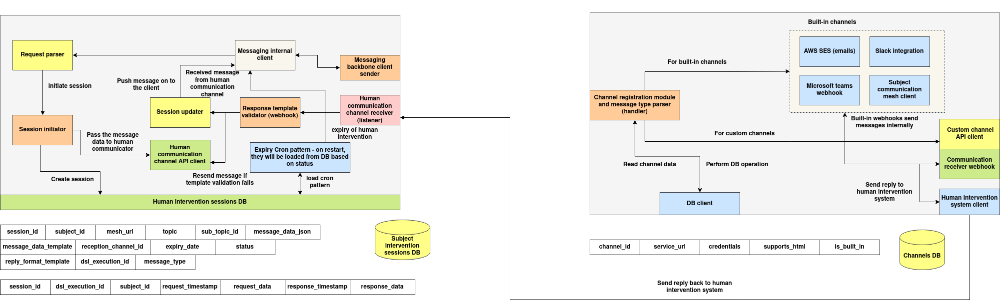

# Human Communication Interface Architecture

## Architecture overview

## 1. Sessions System

### System Overview

The **Sessions System** is the orchestration layer responsible for managing human intervention sessions, enabling structured communication between automation frameworks and human participants. It supports asynchronous, context-rich message dispatch across multiple communication channels, and ensures reliable tracking of replies, validations, and expirations.

Each session is initiated with a unique identifier and is bound to a human subject, DSL execution, and message payload. Sessions persist until a valid response is received or an expiry policy is triggered. The system is designed to operate reliably under distributed deployments, enabling plug-and-play use in federated AI orchestration or decision-assist workflows.

---

### Component Descriptions

#### **Request Parser**

The entry point to the system, responsible for decoding incoming HTTP or service requests that request a human intervention. It extracts required parameters (subject, message, topic, etc.), validates their structure, and forwards them to the session orchestration pipeline. This component ensures that malformed or unauthorized requests are filtered early in the lifecycle.

#### **Session Initiator**

This module creates a new communication session in the **Human Intervention Sessions DB**. It encodes all relevant metadata such as channel ID, message templates, expiration logic, and routing targets. The session record is used for stateful tracking, ensuring every outbound message has an associated context and audit trail.

#### **Human Communication Channel API Client**

Once a session is created, this client component pushes the message to the designated communication channel (Slack, Teams, etc.). It generates a structured payload that includes a `session_id`, a serialized message body, and a `response_url` that the external channel must call upon completion. This abstraction allows the core system to remain decoupled from individual platform protocols.

#### **Human Communication Channel Receiver**

This webhook interface handles incoming responses from external platforms. When a human replies through a Slack message or Teams card, the external server (or built-in integration) invokes this receiver with the session response. It is the primary ingestion point for asynchronous human feedback.

#### **Session Updater**

On receiving a valid response, the updater modifies the session's state in the database — marking it as complete, storing timestamps, and logging the returned data. It may also forward the response to internal systems such as DSL processors or behavior selectors.

#### **Response Template Validator (Webhook)**

This validator is invoked when strict reply formats are configured (e.g., JSON schema, choice format). If the incoming message does not conform to expectations, the message is rejected, and the system may trigger a re-send or escalate the session. This allows for predictable downstream automation behavior.

#### **Messaging Backbone Client Sender**

Once a message is received and validated, it is often required to notify internal systems or trigger workflows. This component acts as a bridge between the session system and downstream services — such as DSL execution environments, agents, or evaluators — by pushing validated payloads onto a messaging backbone (NATS, Redis, etc.).

#### **Expiry Cron Manager**

This background service is responsible for identifying and marking sessions that have exceeded their defined `expiry_date`. It operates on a cron-based schedule and ensures that expired sessions are removed from the active queue. On system restart, it reloads unexpired or incomplete sessions to maintain consistency across deployments.

---

### System Behaviors

* **Asynchronous Retry:** In case of template validation failure, the message can be resent without requiring client re-initiation.
* **Internal Re-invocation:** Messages received can be re-processed via the `Messaging Internal Client` for audit trails or complex workflows.
* **Session Reactivation on Restart:** Sessions that were open during service shutdown are restored using the expiry cron loader.
* **Dual-DB Synchronization:** Both `Human Intervention Sessions DB` and `Subject Intervention Sessions DB` are updated in parallel for audit and access control use cases.

---

## 2. Channels System

### System Overview

The **Channels System** defines and manages the routes through which human-facing messages are delivered and responses are collected. This component abstracts over external communication platforms, allowing the system to dynamically send and receive messages via Slack, Microsoft Teams, emails, or any webhook-compatible server.

Channels are classified as **built-in** or **custom**, each with its own metadata, delivery mechanisms, and capabilities. Messages dispatched to channels are received by external systems, which then respond via HTTP to complete the session lifecycle.

---

### Component Descriptions

#### **Channel Registration Module and Message Type Parser**

This module handles the lifecycle of channels — allowing new channels to be registered, updated, queried, or deleted. It parses the type of messages supported by the channel, determines formatting capabilities (e.g., HTML support), and ensures message templates are compatible before dispatch.

Built-in channels are recognized by their system-defined handler, whereas custom channels must conform to an open contract defined by the system: receiving a payload and responding with a `session_id` + `response_data`.

#### **Built-in Channels**

These include deeply integrated platform connectors for:

* **Slack Integration**
  Uses Slack's API to send messages and interactive elements to human users.

* **Microsoft Teams Webhook**
  Sends adaptive cards or text content through Teams connectors.

* **AWS SES**
  Enables email-based delivery with optional HTML formatting.

* **Subject Communication Mesh Client**
  Used for platform-internal message relaying to subjects (agents/humans) over a trusted mesh layer.

Built-in channels directly invoke internal webhooks for reply delivery, offering tighter integration and reduced latency.

#### **Custom Channel API Client**

For custom platforms (e.g., Discord, WhatsApp, third-party apps), this component handles HTTP POST operations to the channel's externally configured `service_url`. The channel is expected to process the message and invoke the system’s `response_url` with the session response.

This separation of concerns allows external teams to develop their own channel handlers as long as they conform to the system’s API contract.

#### **Communication Receiver Webhook**

All channel responses, regardless of origin, are delivered here. It verifies the `session_id`, validates the format (if needed), and delegates the result to the **Session Updater**.

This webhook forms the cornerstone of the response ingestion layer and ensures platform-agnostic behavior.

#### **Human Intervention System Client**

Upon receiving a valid response, this internal client delivers the reply into the session system. It ensures transactional consistency and may optionally trigger downstream services such as notification systems or retry managers.

---

### System Behaviors

* **Dynamic Channel Resolution:** Channels are looked up at runtime from the `Channels DB`, allowing for extensibility.
* **Platform Abstraction:** Uniform interface for message dispatch and response regardless of target platform.
* **Auditability:** All interactions are logged, and channel metadata (including credentials and tags) is managed centrally.
* **Internal Webhook Optimization:** Built-in channels can bypass external delivery paths by using direct internal service calls.

---

