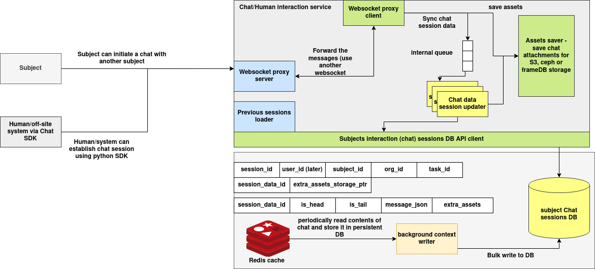

# Chat Proxy Server Documentation

## Introduction

The Chat Proxy Server is designed to manage and route chat messages between users and subject-specific processing services. It supports:

* Creating and managing chat sessions
* Uploading and referencing files in chats
* Logging and querying user/system messages
* Proxying messages to subject-specific endpoints via WebSockets
* Retrieving response messages through persistent connections

This documentation outlines the data structures, REST API endpoints, file upload process, and WebSocket-based message flow.

---

## Architecture



### System Overview

The Chat Proxy Server provides a **real-time, persistent, and extensible messaging layer** for interactive communication between subjects (agents or humans) in a distributed AI environment. Designed to support **session-based conversational state**, the system enables message routing, session lifecycle management, attachment handling, and long-term chat persistence.

It integrates a **WebSocket-based messaging proxy**, a **session updater with Redis caching**, and a **storage backend** to synchronize and archive messages. Each interaction is contextualized per session and can be accessed programmatically via REST APIs or consumed via WebSockets in real time. The system supports both **agent-to-agent** and **human-to-agent** messaging workflows.

The architecture ensures scalable, traceable, and multi-modal communication flows across federated environments such as orchestrated AI services, autonomous reasoning agents, or decision-support systems.

---

### Core Services

**WebSocket Proxy Server**

The WebSocket Proxy Server acts as the **entry point for all live chat interactions**. It performs the following functions:

* Accepts incoming WebSocket connections from clients (humans or systems).
* Receives messages in a structured JSON format containing session and subject information.
* Forwards the message to the appropriate downstream subject via a persistent internal WebSocket connection.
* Returns the response from the subject back to the original client.

This component decouples external message ingress from internal routing, enabling low-latency bi-directional communication.

---

**WebSocket Proxy Client**

The WebSocket Proxy Client is responsible for maintaining **persistent outbound connections** to subject-specific services. For each subject ID, it:

* Resolves the subject's WebSocket endpoint using a registry lookup.
* Maintains a pool of reusable connections.
* Sends incoming messages via `.push()` method.
* Waits for responses and returns them to the server for client delivery.

It ensures message delivery across services without initiating new connections per request.

---

**Chat Data Session Updater**

This internal service manages **session state synchronization**. It:

* Queues messages and session updates in memory.
* Writes metadata and chat content to Redis for short-term persistence.
* Updates session context (e.g., metadata, attachments) in an append-only format.
* Invokes the asset saver when files are present.

This component provides consistent session tracking for ongoing conversations.

---

**Previous Sessions Loader**

This module retrieves **prior chat sessions** for a given user or subject. It ensures conversational continuity by:

* Fetching chat history from the persistent store.
* Preloading recent interactions into memory if necessary.
* Enabling context-aware responses from downstream models or agents.

---

**Assets Saver**

The Assets Saver handles **attachment persistence** for each chat message. It supports integration with multiple backend storage systems, including:

* AWS S3
* Ceph-compatible object stores
* FrameDB-based storage layers

This allows rich media (e.g., PDFs, documents) to be referenced in chat messages and stored independently of the core session data.

---

**Redis Cache and Background Context Writer**

Chat data is **initially buffered in Redis** to optimize performance. The system:

* Temporarily caches incoming and outgoing messages using `session_data_id`.
* Periodically invokes a background writer to flush the contents to the subject sessions database.
* Tags messages with `is_head` and `is_tail` flags to denote sequence boundaries.
* Tracks structured `message_json` and `extra_assets` fields.

This design allows low-latency reads while ensuring persistent storage for long-term analysis or audit.

---

**Subject Chat Sessions DB**

This is the **primary persistent backend** for chat data, supporting:

* Session-level metadata (user ID, subject ID, org ID, task ID)
* Message-level content with time-ordering
* Associated storage pointers (attachments, asset links)

Data is written in bulk from Redis by the context writer, ensuring efficient and reliable persistence.

---

## Data Schemas

### `ChatSession` Dataclass

```python
@dataclass
class ChatSession:
    session_id: str = field(default_factory=lambda: str(uuid.uuid4()))
    user_id: str = ''
    subject_id: str = ''
    org_id: str = ''
    session_metadata: Dict[str, Any] = field(default_factory=dict)
```

#### Explanation of Fields

| Field              | Type   | Description                                                  |
| ------------------ | ------ | ------------------------------------------------------------ |
| `session_id`       | `str`  | Unique identifier for the chat session (auto-generated UUID) |
| `user_id`          | `str`  | ID of the user initiating the session                        |
| `subject_id`       | `str`  | Subject to which the chat is routed                          |
| `org_id`           | `str`  | Organization identifier                                      |
| `session_metadata` | `dict` | Additional metadata about the session                        |

---

### `ChatMessage` Dataclass

```python
@dataclass
class ChatMessage:
    chat_id: str = field(default_factory=lambda: str(uuid.uuid4()))
    session_id: str = ''
    message_json: Dict[str, Any] = field(default_factory=dict)
    file_urls: Dict[str, str] = field(default_factory=dict)
    type: str = ''  # 'user' or 'system'
    timestamp: int = field(default_factory=lambda: int(time.time()))
```

#### Explanation of Fields

| Field          | Type   | Description                                    |
| -------------- | ------ | ---------------------------------------------- |
| `chat_id`      | `str`  | Unique identifier for the message (UUID)       |
| `session_id`   | `str`  | Session ID to which the message belongs        |
| `message_json` | `dict` | The actual message payload                     |
| `file_urls`    | `dict` | Optional mapping of file keys or URLs          |
| `type`         | `str`  | Message type: `"user"` or `"system"`           |
| `timestamp`    | `int`  | UNIX timestamp of when the message was created |

---

## Flask REST APIs

### Create Chat Session

**POST** `/chat/session`

**Request Body (JSON):**

```json
{
  "user_id": "user123",
  "subject_id": "math-ai",
  "org_id": "org789",
  "session_metadata": {}
}
```

**Curl:**

```bash
curl -X POST http://localhost:7000/chat/session \
     -H "Content-Type: application/json" \
     -d '{"user_id": "user123", "subject_id": "math-ai", "org_id": "org789", "session_metadata": {}}'
```

---

### Get Chat Session

**GET** `/chat/session/<session_id>`

**Curl:**

```bash
curl http://localhost:7000/chat/session/abc123
```

---

### Update Chat Session

**PUT** `/chat/session/<session_id>`

**Request Body:**

```json
{ "session_metadata": { "topic": "algebra" } }
```

**Curl:**

```bash
curl -X PUT http://localhost:7000/chat/session/abc123 \
     -H "Content-Type: application/json" \
     -d '{"session_metadata": {"topic": "algebra"}}'
```

---

### Delete Chat Session

**DELETE** `/chat/session/<session_id>`

**Curl:**

```bash
curl -X DELETE http://localhost:7000/chat/session/abc123
```

---

### Query Chat Sessions

**POST** `/chat/session/query`

**Request Body:**

```json
{ "user_id": "user123" }
```

**Curl:**

```bash
curl -X POST http://localhost:7000/chat/session/query \
     -H "Content-Type: application/json" \
     -d '{"user_id": "user123"}'
```

---

### Get Messages by Session

**GET** `/chat/message/session/<session_id>`

**Curl:**

```bash
curl http://localhost:7000/chat/message/session/abc123
```

---

### Get Message by Chat ID

**GET** `/chat/message/<chat_id>`

**Curl:**

```bash
curl http://localhost:7000/chat/message/def456
```

---

### Delete Message by Chat ID

**DELETE** `/chat/message/<chat_id>`

**Curl:**

```bash
curl -X DELETE http://localhost:7000/chat/message/def456
```

---

## Uploading Files

**POST** `/chat/session/<session_id>/upload`

**Form Field:** `file` (multipart/form-data)

**Curl Example:**

```bash
curl -X POST http://localhost:7000/chat/session/abc123/upload \
     -F "file=@myfile.pdf"
```

**Response:**

```json
{
  "success": true,
  "data": {
    "message": "File uploaded successfully",
    "file_path": "abc123/uuid-filename",
    "original_filename": "myfile.pdf"
  }
}
```

---

## Sending and Receiving Chat Messages Using WebSocket

WebSocket clients can send a message to a subject and receive a response in real-time.

### WebSocket Proxy Behavior

* The proxy fetches `chatURL` from:
  `GET <SUBJECTS_REGISTRY>/subjects/get_subject_id?subject_id=<id>`
* It caches and maintains persistent WebSocket connections per subject
* Messages are forwarded using `.push()`
* The server waits for a response and returns it to the client

---

### Example WebSocket Flow

**Client sends:**

```json
{
  "session_id": "abc123",
  "text": "What is 2 + 2?"
}
```

**Server forwards to subject WebSocket (e.g., ws\://math-subject:8001/ws)**

**Subject responds:**

```json
{
  "response": "The answer is 4"
}
```

**ChatManager:**

* Logs the request with type `"user"`
* Logs the response with type `"system"`
* Returns the response to client

---

## WebSocket Server Sample (Optional)

You can connect to a local WebSocket server like this:

```bash
websocat ws://localhost:8765
```

And send a JSON payload:

```json
{
  "action": "query_by_session",
  "data": { "session_id": "abc123" }
}
```

---


## Python Example: Sending a Message via WebSocket Proxy

This example does the following:

1. Sends a message to the chat proxy server.
2. The server resolves the subject's WebSocket URL.
3. It forwards the message and waits for a response.
4. The user message and the system response are logged in MongoDB.
5. The response is returned to the user.

---

### Requirements

```bash
pip install websockets requests
```

---

### Python Client Example

```python
import asyncio
import json
import websockets


async def send_chat_message():
    # Replace with the actual WebSocket URL of your chat proxy server
    ws_url = "ws://localhost:8765"

    session_id = "abc123"   # Use your valid session ID
    subject_id = "math-ai"  # Target subject to route the message
    message_text = "What is the integral of x^2?"

    # Construct the payload expected by the WebSocket chat proxy
    message = {
        "session_id": session_id,
        "subject_id": subject_id,
        "message": {
            "text": message_text
        }
    }

    # Connect to the proxy WebSocket server
    async with websockets.connect(ws_url) as websocket:
        # Send the message
        await websocket.send(json.dumps(message))

        # Wait for a response
        response = await websocket.recv()
        response_data = json.loads(response)

        print("Response received:")
        print(json.dumps(response_data, indent=2))


if __name__ == "__main__":
    asyncio.run(send_chat_message())
```

---

### Sample Output

```json
Response received:
{
  "response": "The integral of x^2 is (1/3)x^3 + C"
}
```

---

### Notes

* This script assumes your proxy WebSocket server accepts messages in a JSON structure like:

  ```json
  {
    "session_id": "...",
    "subject_id": "...",
    "message": { "text": "..." }
  }
  ```

* The `ChatManager` on the backend will log:

  * The **incoming user message** (type: `"user"`)
  * The **outgoing system response** (type: `"system"`)

---

