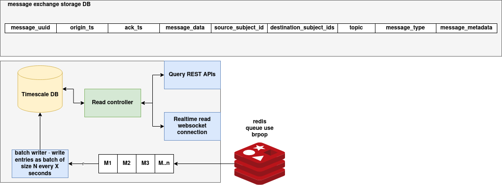

# Message Logger Service Documentation

## Introduction

The **Message Logger Service** is a backend service that captures and persists message exchanges between distributed agents or services. It is designed for efficient, high-throughput message logging using Redis for ingestion and TimescaleDB for storage. The service includes:

* A Redis-based ingestion pipeline for buffering and batching.
* A PostgreSQL/TimescaleDB storage backend optimized for time-series data.
* REST APIs for querying messages by UUID or participant subject.

This service is suitable for use cases like audit logging, inter-service communication tracing, and message event monitoring.

---

## Architecture



---

## Message Log Schema

Messages are stored in the `message_exchange` table with the following schema:

| Column Name               | Data Type   | Description                                                     |
| ------------------------- | ----------- | --------------------------------------------------------------- |
| `message_uuid`            | UUID        | Unique identifier for the message (primary key).                |
| `origin_ts`               | TIMESTAMPTZ | Timestamp indicating when the message was created.              |
| `ack_ts`                  | TIMESTAMPTZ | Timestamp indicating when the message was acknowledged.         |
| `message_data`            | JSONB       | The actual payload of the message.                              |
| `source_subject_id`       | TEXT        | ID of the subject that sent the message.                        |
| `destination_subject_ids` | TEXT\[]     | List of IDs of the subjects that are the recipients.            |
| `topic`                   | TEXT        | Topic or channel under which the message was categorized.       |
| `message_type`            | TEXT        | Type or classification of the message (e.g., "event", "alert"). |
| `message_metadata`        | JSONB       | Additional metadata related to the message.                     |

---

## Batched Writing via Redis Consumer

The system uses a Redis-backed ingestion pipeline that buffers messages and writes them in batches to reduce write amplification and improve performance.

### Process Overview

1. Messages are published to a Redis list (configured via `Config.REDIS_QUEUE`).
2. The `RedisConsumer` class listens to the Redis queue using `BRPOP`.
3. Received messages are:

   * Parsed into a tuple.
   * Added to a buffer.
4. When the buffer reaches a configured `BATCH_SIZE` or after a specified `BATCH_INTERVAL`, the messages are bulk inserted into TimescaleDB via `INSERT ... VALUES`.

This design ensures efficient ingestion while maintaining data integrity and reducing database I/O load.

---

## REST APIs to Query Messages

The service exposes two REST endpoints via a Flask web server for retrieving message logs.

### Get Message by UUID

**Endpoint:**

```
GET /messages/<message_uuid>
```

**Description:**
Fetches a single message by its unique UUID.

**Example:**

```bash
curl http://localhost:5000/messages/123e4567-e89b-12d3-a456-426614174000
```

**Response:**

```json
{
  "message_uuid": "123e4567-e89b-12d3-a456-426614174000",
  "origin_ts": "2025-05-27T10:30:00Z",
  "ack_ts": "2025-05-27T10:30:01Z",
  "message_data": {"text": "hello"},
  "source_subject_id": "subject-A",
  "destination_subject_ids": ["subject-B"],
  "topic": "greetings",
  "message_type": "chat",
  "message_metadata": {"priority": "high"}
}
```

---

### Get Messages by Subject ID

**Endpoint:**

```
GET /messages/subject/<subject_id>
```

**Description:**
Fetches all messages where the given subject is either the sender or a recipient.

**Example:**

```bash
curl http://localhost:5000/messages/subject/subject-A
```

**Response:**

```json
[
  {
    "message_uuid": "123e4567-e89b-12d3-a456-426614174000",
    "origin_ts": "...",
    "ack_ts": "...",
    ...
  },
  {
    "message_uuid": "456e7890-f12a-34d5-b678-526617183333",
    "origin_ts": "...",
    "ack_ts": "...",
    ...
  }
]
```

---


## WebSocket Server for Real-Time Updates

The service includes a WebSocket server that enables clients to receive message logs in real-time as they are published to Redis.

### How It Works

* The server subscribes to a Redis **pub/sub** channel specified in `Config.REDIS_QUEUE`.
* When a new message is published to Redis:

  * It is broadcast to all connected WebSocket clients.
* The server maintains active connections using an internal `clients` registry.

### WebSocket Endpoint

* **Protocol**: WebSocket (`ws://`)
* **Port**: Configurable in deployment environment
* **Path**: Root (`/`) by default

Clients can connect using a standard WebSocket client to the exposed server address.

### Example WebSocket Client

```python
import asyncio
import websockets

async def listen():
    uri = "ws://<websocket-host>:<port>"
    async with websockets.connect(uri) as websocket:
        while True:
            message = await websocket.recv()
            print("Received:", message)

asyncio.run(listen())
```

Replace `<websocket-host>` and `<port>` with the actual deployment address of the WebSocket server.

### Internal Architecture

| Component                | Description                                               |
| ------------------------ | --------------------------------------------------------- |
| `handler`                | Handles WebSocket client connections.                     |
| `broadcast_message`      | Sends new Redis messages to all active WebSocket clients. |
| `listen_to_redis`        | Subscribes to Redis and listens for new messages.         |
| `start_websocket_server` | Initializes both the WebSocket server and Redis listener. |

This component is useful for streaming dashboards or real-time monitoring tools that require instant visibility into new message events without polling APIs.

---