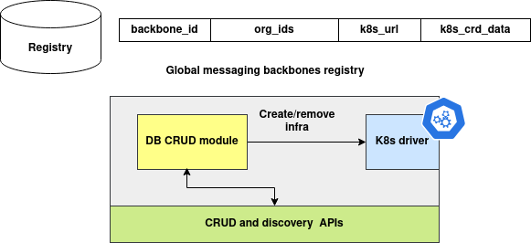

# BackboneData Registry API Documentation

## Introduction

The **BackboneData Registry** is a global system registry for tracking and managing all deployed *information communication exchanges* (ICEs) within a **multi-cluster global network**. Each ICE is uniquely identifiable and associated with an organization, cluster, and access metadata. This registry enables visibility, discovery, and metadata-driven routing of communication systems across federated clusters.

---

## Architecture



---

### Python Data-Class

```python
from dataclasses import dataclass, field, asdict
from typing import Dict, Any
import uuid

@dataclass
class BackboneDataObject:
    system_id: str = field(default_factory=lambda: str(uuid.uuid4()))
    org_ids: str = ''
    cluster_id: str = ''
    public_url: str = ''
    metadata: Dict[str, Any] = field(default_factory=dict)
    name: str = ''

    @classmethod
    def from_dict(cls, data: Dict[str, Any]) -> 'BackboneDataObject':
        return cls(
            system_id=str(data.get('system_id', uuid.uuid4())),
            org_ids=data.get('org_ids', ''),
            cluster_id=data.get('cluster_id', ''),
            public_url=data.get('public_url', ''),
            metadata=data.get('metadata', {}),
            name=data.get('name', '')
        )

    def to_dict(self) -> Dict[str, Any]:
        return asdict(self)
```

### Field Explanation

| Field        | Type             | Description                                                                |
| ------------ | ---------------- | -------------------------------------------------------------------------- |
| `system_id`  | `str` (UUID)     | Unique identifier for the communication system (auto-generated if missing) |
| `org_ids`    | `str`            | Comma-separated organization IDs linked to this system                     |
| `cluster_id` | `str`            | ID of the cluster where the system is deployed                             |
| `public_url` | `str`            | Publicly accessible URL for the system's API or service                    |
| `metadata`   | `Dict[str, Any]` | Arbitrary metadata about the system (e.g., type, version, region)          |
| `name`       | `str`            | Human-readable name of the deployed system                                 |

---

## REST API Documentation

### Base URL

```
http://<your-host>:8000
```

---

### Create Backbone Record

* **Method**: `POST`
* **Endpoint**: `/backbone`
* **Description**: Registers a new deployed communication system.

#### Request Body (JSON)

```json
{
  "org_ids": "org123,org456",
  "cluster_id": "cluster-a",
  "public_url": "https://cluster-a.example.com/api",
  "metadata": {
    "region": "us-west",
    "version": "v1.0"
  },
  "name": "UserSyncService"
}
```

#### CURL Example

```bash
curl -X POST http://localhost:8000/backbone \
  -H "Content-Type: application/json" \
  -d '{
    "org_ids": "org123",
    "cluster_id": "cluster-a",
    "public_url": "https://example.com",
    "metadata": {"type": "pubsub"},
    "name": "ICE-Publisher"
  }'
```

---

### Get Backbone Record by `system_id`

* **Method**: `GET`
* **Endpoint**: `/backbone/<system_id>`
* **Description**: Retrieves a specific record by its unique `system_id`.

#### CURL Example

```bash
curl http://localhost:8000/backbone/2e733b76-79d1-4f5b-912d-44fbc2d0f514
```

---

### Update Backbone Record

* **Method**: `PUT`
* **Endpoint**: `/backbone/<system_id>`
* **Description**: Updates fields for the specified `system_id`.

#### Request Body (JSON)

```json
{
  "metadata": {
    "version": "v1.1",
    "region": "us-east"
  }
}
```

#### CURL Example

```bash
curl -X PUT http://localhost:8000/backbone/2e733b76-... \
  -H "Content-Type: application/json" \
  -d '{"metadata": {"region": "eu-central", "status": "active"}}'
```

---

### Delete Backbone Record

* **Method**: `DELETE`
* **Endpoint**: `/backbone/<system_id>`
* **Description**: Permanently deletes a record.

#### CURL Example

```bash
curl -X DELETE http://localhost:8000/backbone/2e733b76-...
```

---

### Query Backbone Records

* **Method**: `POST`
* **Endpoint**: `/backbones`
* **Description**: Search using any filter (e.g., by cluster, org, etc.)

#### Request Body (JSON)

```json
{
  "cluster_id": "cluster-a"
}
```

#### CURL Example

```bash
curl -X POST http://localhost:8000/backbones \
  -H "Content-Type: application/json" \
  -d '{"cluster_id": "cluster-a"}'
```

---
